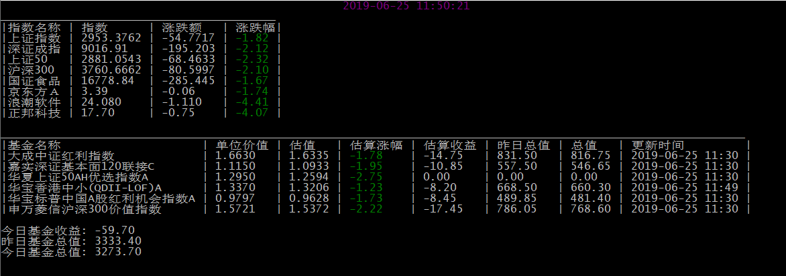

# shell基金小工具

1. 在fund.conf配置需要的基金和指数

   ```
   [fund]
   090010=大成中证红利指数
   005998=嘉实深证基本面120联接C
   501050=华夏上证50AH优选指数
   501021=华宝香港中小(QDII-LOF)A
   501029=华宝标普中国A股红利机会指数A
   310398=申万菱信沪深300价值指数

   [stock]
   sh000001=上证指数
   sz399001=深证成指
   sh000016=上证50
   sh000300=沪深300
   sz399396=国证食品
   sz000725=京东方A
   sh600756=浪潮软件
   sz002157=正邦科技

   [buy_fund]
   501029=500
   501021=500
   005998=500
   090010=500
   310398=500
   ```

2. 运行

   ```
   # 默认配置文件
   $ python fund.py

   # 指定配置文件
   $ python fund.py config
   ```

3. 效果图

   
